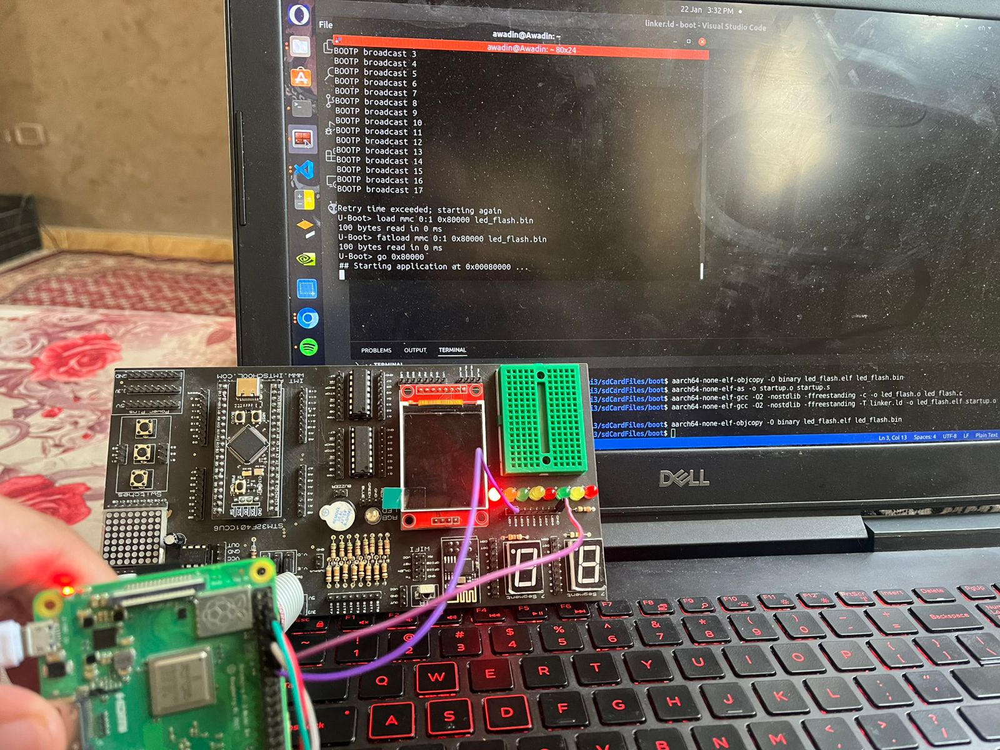

# Bare-Metal LED Flashing on Raspberry Pi 3B+ (GPIO23)

This project demonstrates how to write a bare-metal application to turn on an LED connected to **GPIO23** on the Raspberry Pi 3B+. The application is written in C and ARM assembly, compiled into a binary, and loaded onto the Raspberry Pi using U-Boot.

---

## **Files Overview**

### 1. `led_flash.c`
This is the main C program that configures GPIO23 as an output and sets it high to turn on the LED.

#### Key Features:
- Defines the base address for the GPIO peripheral (`0x3F200000` for BCM2837).
- Configures GPIO23 as an output by setting the appropriate bits in the `GPFSEL2` register.
- Sets GPIO23 high using the `GPSET0` register.
- Enters an infinite loop to keep the LED on.

---

### 2. `startup.s`
This is the startup assembly file that initializes the stack pointer and jumps to the `main` function in the C program.

#### Key Features:
- Sets the stack pointer to a safe location (`0x800000`).
- Branches to the `main` function in the C program.
- Includes an infinite loop to prevent the program from exiting.

---

### 3. `linker.ld`
This is the linker script that defines the memory layout for the program.

#### Key Features:
- Specifies the load address for the program (`0x80000` for U-Boot).
- Defines sections for `.text`, `.rodata`, `.data`, and `.bss`.
- Discards unnecessary sections (e.g., `.comment`, `.gnu*`).

---

## **Hardware Setup**

### Wiring:
1. Connect the anode (long leg) of the LED to **GPIO23** (physical pin 16).
2. Connect the other end of the resistor to **GND** (physical pin 14).

---

## **Steps to Compile and Run the Code**

### 1. Compile the Code
1. **Assemble the Startup File**:
   ```bash
   aarch64-linux-gnu-as -o startup.o startup.s
   ```

2. **Compile the C Code**:
   ```bash
   aarch64-linux-gnu-gcc -O2 -nostdlib -ffreestanding -c -o led_flash.o led_flash.c
   ```

3. **Link the Object Files**:
   ```bash
   aarch64-linux-gnu-gcc -O2 -nostdlib -ffreestanding -T linker.ld -o led_flash.elf startup.o led_flash.o
   ```

4. **Generate the Binary File**:
   ```bash
   aarch64-linux-gnu-objcopy -O binary led_flash.elf led_flash.bin
   ```

---

### 2. Prepare the SD Card
1. Copy the following files to the `boot` partition of the SD card:
   - `bootcode.bin`
   - `start.elf`
   - `fixup.dat`
   - `config.txt`
   - `cmdline.txt`
   - `bcm2837-rpi-3-b-plus.dtb`
   - `led_flash.bin`

2. Ensure the `config.txt` file contains the following line to enable UART (optional for debugging):
   ```plaintext
   enable_uart=1
   ```

---

### 4. Load and Run the Binary
1. Insert the SD card into the Raspberry Pi and power it on.
2. Interrupt the boot process to access the U-Boot command line.
3. Load the binary into memory:
   ```bash
   load mmc 0:1 0x80000 led_flash.bin
   ```
4. Run the binary:
   ```bash
   go 0x80000
   ```

---

### 5. Expected Behavior
- The LED connected to GPIO23 will turn on and remain on.
- The program will enter an infinite loop, keeping the LED lit.

---

## **Code Files**

### `led_flash.c`
```c
#include <stdint.h>

// Base address for GPIO peripheral (BCM2837)
#define GPIO_BASE 0x3F200000

// GPIO register offsets
#define GPFSEL2   (GPIO_BASE + 0x08)  // GPIO Function Select 2 (controls GPIO 20-29)
#define GPSET0    (GPIO_BASE + 0x1C)  // GPIO Pin Output Set 0 (controls GPIO 0-31)
#define GPCLR0    (GPIO_BASE + 0x28)  // GPIO Pin Output Clear 0 (controls GPIO 0-31)

// Main function
void main() {
    // Configure GPIO23 as output
    volatile uint32_t* gpfsel2 = (uint32_t*)GPFSEL2;
    *gpfsel2 &= ~(7 << 9);  // Clear bits 9-11 (GPIO23)
    *gpfsel2 |= (1 << 9);   // Set GPIO23 as output (001 in bits 9-11)

    // Turn on the LED (set GPIO23 high)
    volatile uint32_t* gpset0 = (uint32_t*)GPSET0;
    *gpset0 = (1 << 23);  // Set GPIO23 high

    // Infinite loop to prevent returning
    while (1) {
    }
}
```

### `startup.s`
```asm
.globl _start
_start:

    // Initialize the stack
    ldr x0, =0x800000  
    mov sp, x0
    
    // Branch to main
    ldr x0, =main       
    br x0              

    // Infinite loop 
hang:
    b hang
```

### `linker.ld`
```ld
SECTIONS
{
    . = 0x80000; /* Load address for U-Boot */

    .text : {
        *(.text*)
    }

    .rodata : {
        *(.rodata*)
    }

    .data : {
        *(.data*)
    }

    .bss : {
        *(.bss*)
    }
}
```

---

## **Final Output Photo**
<p align='center'>

</p> 

---