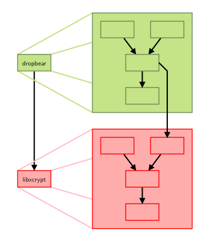
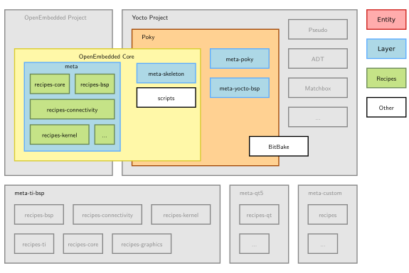

## Your First Steps To Understand Yocto Project 


-  The Yocto Project is an open source collaboration project that allows to build custom embedded Linux-based systems.


### Yocto: principle :


- Yocto always builds binary packages (a “distribution”)
- The final root filesystem is generated from the package feed

-------
#### In Yocto / OpenEmbedded, the build engine is implemented by the **bitbake** program
- bitbake is a **task scheduler** and Execution Engine, like make
- bitbake parses text files to know what it has to build and how
- It is written in Python (need Python 3 on the development host)

- The main kind of text file parsed by bitbake is **recipes**, each describing a specific software component
- Each Recipe describes >> how to fetch and build a software component: e.g. a program, a library or an image

- They have a specific syntax
- bitbake can be asked to build any recipe,building all its dependencies automatically beforehand

---

#### Understand How the Tasks Recipes Work :

- The build process implemented by a recipe is split in several tasks
- Each task performs a specific step in the build
- Examples: fetch, configure, compile, package
- Tasks can depend on other tasks (including on tasks of other recipes)


----
#### Understand Metadata And Layers :

- The input to bitbake is collectively called **MetaData**

- Metadata: Set of Informations, and How to Build ?

- Metadata includes configuration files, recipes, classes and include files

- Metadata is organized in *layers*, which can be composed to get various components

  - **Layer**  : is a set of *recipes*, *configurations* files and classes matching a common
    purpose.
  - **Example :** `openembedded-core` is the core layer >>  All other layers are built on top of openembedded-core.

---

### What is the **POKY** meaning ???

- The word **Poky** has several meanings :

  1. **Poky** is a git repository that is assembled from other git repositories: bitbake, openembedded-core, yocto-docs and meta-yocto

  2. **poky** is the reference distro provided by the Yocto Project

  3. **meta-poky** is the layer providing the poky reference distribution

     

     

---

#### Board Support Package(BSP) : 

- Layers to Enable Support for Specific Hardware Platform 
- To build images for a Raspberry Pi, we need:
  • The Poky reference system, containing all common recipes and tools.
  • The meta-raspberrypi-bsp layer, a set of Raspberry Pi specific recipes.

----

#### Yocto Project Quick Build :

##### Build Host Packages :

- You must install essential host packages on your build host. The following command installs the host packages based on an Ubuntu distribution:

  ```bash
  $ sudo apt install build-essential chrpath cpio debianutils diffstat file gawk gcc git iputils-ping libacl1 liblz4-tool locales python3 python3-git python3-jinja2 python3-pexpect python3-pip python3-subunit socat texinfo unzip wget xz-utils zstd
  
  ```

  

  #### Use Git to Clone Poky:

- Make Your own Yocto Working Directory 

- Once you complete the setup instructions for your machine, you need to get a copy of the Poky repository on your build host. Use the following commands to clone the Poky repository.

  ```bash
  $ mkdir yocto
  $ git clone git://git.yoctoproject.org/poky
  $ cd poky 
  
  ```

- Go to [Releases wiki page](https://wiki.yoctoproject.org/wiki/Releases), and choose a release codename (such as `styhead`), corresponding to either the latest stable release or a Long Term Support release.

- I Choose ``Kirkstone`` which is more suitable Release  

  ```bash
  $ git checkout kirkstone 
  ```

#### Poky Source Tree 



- **bitbake/** Holds all scripts used by the bitbake command. Usually matches the
  stable release of the BitBake project.
- **documentation/** All documentation sources for the Yocto Project documentation. Can be used to generate nice PDFs.
- **meta/** Contains the OpenEmbedded-Core metadata.
- **meta-skeleton/** Contains template recipes for **BSP** and kernel development.
- **meta-poky/** Holds the configuration for the Poky reference distribution.
- **meta-yocto-bsp/** Configuration for the Yocto Project reference hardware board
  support package.
- **LICENSE** The license under which Poky is distributed (a mix of GPLv2 and MIT).
- **oe-init-build-env** Script to set up the OpenEmbedded build environment. It will create
  the build directory.
- **scripts/** Contains scripts used to set up the environment, development tools,
  and tools to flash the generated images on the target.


-------

#### Environment setup and oe-init-build-env Script :

- Specific configuration files and build repositories are stored in a separate build
  directory.

- A script, `oe-init-build-env`, is provided to set up the build directory and the
  environment variables (needed to be able to use the bitbake command for
  example).

  ```bash
  $ source ./oe-init-build-env ../build_rpi
  ```

  - Sets up a basic build directory, named `builddir` in `../` . If not provided,
    the default name is build.
  - The `oe-init-build-env` script creates the build directory with only one
    subdirectory in it: **conf** Configuration files. Image specific and layer configuration.
  - `bitbake` The main build engine command. Used to perform tasks on available
    recipes (download, configure, compile…).
  - `bitbake-*` Various specific commands related to the BitBake build engine.

---


#### Configuring the build system :

- The **conf/** directory in the build one holds two mandatory build-specific configuration files:

  - **bblayers.conf** Explicitly list the layers to use.

  - **local.conf** Set up the configuration variables relative to the current user for the
    build. Configuration variables can be overridden there.

    -------------------

    

##### 1- The `conf/local.conf` configuration file holds local user configuration variables:

- BB_NUMBER_THREADS: How many tasks BitBake should perform in parallel.
  Defaults to the number of CPU threads on the system.

- PARALLEL_MAKE: How many processes should be used when compiling. Defaults
  to the number of CPU threads on the system.

  - Ex:

    ```
    BB_NUMBER_THREADS = "7"
    PARALLEL_MAKE = "-j 7"
    ```

- MACHINE: The machine the target is built for,

  - EX :

    ```
    MACHINE ??= "raspberrypi3-64"
    ```

- For More Configuration Variables :
  - https://docs.yoctoproject.org/genindex.html

---------------

#### Clone Raspberrypi OpenEmbedded  MetaData :

- To clone the metadata for the Raspberry Pi using OpenEmbedded, you typically need to clone the `meta-raspberrypi` layer, which contains the necessary configurations and recipes for building images for Raspberry Pi devices. Below are the steps to clone the metadata:

  ##### 1. Clone the `meta-raspberrypi` Layer

  Navigate to the directory where you want to clone the metadata and run the following command:

  ```bash
  git clone git://git.yoctoproject.org/meta-raspberrypi
  ```

  This will clone the `meta-raspberrypi` layer into a directory named `meta-raspberrypi`.

  ##### 2. Add the `meta-raspberrypi` Layer

  After initializing the build environment, you need to add the `meta-raspberrypi` layer to your `bblayers.conf` file. This file is located in the `conf` directory of your build environment.

  Edit the `conf/bblayers.conf` file and add the path to the `meta-raspberrypi` layer:

  ```bash
  BBLAYERS += " /path/to/meta-raspberrypi "
  ```

  ##### 3. Configure the Build for Raspberry Pi

  You may need to configure your build to target a specific Raspberry Pi model. This can be done by setting the `MACHINE` variable in your `conf/local.conf` file:

  ```bash
  MACHINE = "raspberrypi3"  # or "raspberrypi4", "raspberrypi0", etc.
  ```

----

#### Build Your Custom Own Image :

- The compilation is handled by the BitBake build engine.

- Usage: bitbake [options] [recipename/target ...]

- You Can Use This Command to List Images :

  - ```bash
    $ bitbake -s | grep core- image 
    ```

- The OpenEmbedded build system provides several example images to satisfy different needs.:

  - Here is a list of supported recipes and its Features :
    - `core-image-base`: A console-only image that fully supports the target device hardware.
    - `core-image-full-cmdline`: A console-only image with more full-featured Linux system functionality installed.
    - `core-image-lsb`: An image that conforms to the Linux Standard Base (LSB) specification. This image requires a distribution configuration that enables LSB compliance (e.g. `poky-lsb`). If you build `core-image-lsb` without that configuration, the image will not be LSB-compliant.
    - `core-image-lsb-dev`: A `core-image-lsb` image that is suitable for development work using the host. The image includes headers and libraries you can use in a host development environment. This image requires a distribution configuration that enables LSB compliance (e.g. `poky-lsb`). If you build `core-image-lsb-dev` without that configuration, the image will not be LSB-compliant.
    - `core-image-lsb-sdk`: A `core-image-lsb` that includes everything in the cross-toolchain but also includes development headers and libraries to form a complete standalone SDK. This image requires a distribution configuration that enables LSB compliance (e.g. `poky-lsb`). If you build `core-image-lsb-sdk` without that configuration, the image will not be LSB-compliant. This image is suitable for development using the target.
    - `core-image-minimal`: A small image just capable of allowing a device to boot.
    - `core-image-minimal-dev`: A `core-image-minimal` image suitable for development work using the host. The image includes headers and libraries you can use in a host development environment.
    - `core-image-minimal-initramfs`: A `core-image-minimal` image that has the Minimal RAM-based Initial Root Filesystem ([Initramfs](https://docs.yoctoproject.org/ref-manual/terms.html#term-Initramfs)) as part of the kernel, which allows the system to find the first “init” program more efficiently. See the [PACKAGE_INSTALL](https://docs.yoctoproject.org/ref-manual/variables.html#term-PACKAGE_INSTALL) variable for additional information helpful when working with [Initramfs](https://docs.yoctoproject.org/ref-manual/terms.html#term-Initramfs) images.
    - `core-image-minimal-mtdutils`: A `core-image-minimal` image that has support for the Minimal MTD Utilities, which let the user interact with the MTD subsystem in the kernel to perform operations on flash devices.
    - `core-image-rt`: A `core-image-minimal` image plus a real-time test suite and tools appropriate for real-time use.
    - `core-image-rt-sdk`: A `core-image-rt` image that includes everything in the cross-toolchain. The image also includes development headers and libraries to form a complete stand-alone SDK and is suitable for development using the target.
    - `core-image-sato`: An image with Sato support, a mobile environment and visual style that works well with mobile devices. The image supports X11 with a Sato theme and applications such as a terminal, editor, file manager, media player, and so forth.
    - `core-image-sato-dev`: A `core-image-sato` image suitable for development using the host. The image includes libraries needed to build applications on the device itself, testing and profiling tools, and debug symbols. This image was formerly `core-image-sdk`.
    - `core-image-sato-sdk`: A `core-image-sato` image that includes everything in the cross-toolchain. The image also includes development headers and libraries to form a complete standalone SDK and is suitable for development using the target.
    - `core-image-testmaster`: A “controller” image designed to be used for automated runtime testing. Provides a “known good” image that is deployed to a separate partition so that you can boot into it and use it to deploy a second image to be tested. You can find more information about runtime testing in the “[Performing Automated Runtime Testing](https://docs.yoctoproject.org/test-manual/runtime-testing.html#performing-automated-runtime-testing)” section in the Yocto Project Test Environment Manual.
    - `core-image-testmaster-initramfs`: A RAM-based Initial Root Filesystem ([Initramfs](https://docs.yoctoproject.org/ref-manual/terms.html#term-Initramfs)) image tailored for use with the `core-image-testmaster` image.
    - `core-image-weston`: A very basic Wayland image with a terminal. This image provides the Wayland protocol libraries and the reference Weston compositor. For more information, see the “[Using Wayland and Weston](https://docs.yoctoproject.org/dev-manual/wayland.html#using-wayland-and-weston)” section in the Yocto Project Development Tasks Manual.
    - `core-image-x11`: A very basic X11 image with a terminal

- I Building a minimal image: `bitbake core-image-minimal`

  - ```bash
    $ bitbake core-image-minimal
    ```

  - It will takes some hours depend on your PC and Internet, so be patient 


----------------------------

#### What You will Find In Your build_rpi/ Directory after Build Your Image :


- **conf/** Configuration files, as before, not touched by the build.

- **downloads/** Downloaded upstream tarballs of the recipes used in the builds.

- **sstate-cache/** Shared state cache. Used by all builds.

- **tmp/** Holds all the build system outputs.

  - tmp/work/ Set of specific work directories, split by architecture. They are used to
    unpack, configure and build the packages. Contains the patched sources, generated objects and logs.
  - tmp/sysroots/ Shared libraries and headers used to compile applications for the target but also for the host.
  - tmp/deploy/ Final output of the build.
  - tmp/deploy/images/ Contains the complete images built by the OpenEmbedded build system. These images are used to flash the target.
  - tmp/buildstats/ Build statistics for all packages built (CPU usage, elapsed time, host, timestamps…).

  

----

### Flashing Your Image on SdCard :

#### Image Folder

**/build_rpi/tmp/deploy/images/raspberrypi3-64/**

#### Identify  Image File

We need to find the **.wic** file with starts with our Image name.

But as we see it is a symblink, we need to find the orignal file. the extention of the file will be the same i.e. **.wic**

#### Which Flash Tool to Use?

##### dd

- Dangerous to use, unrecoverable data, if wrong device is used to flash.

##### Etcher

* Safe to use
* Hides system memory devices and shows external devices
* Download from https://www.balena.io/etcher

**We will be using Etcher**

##### How to Flash?

##### Etcher

* Download  Etcher
* Go to the Download folder
* Right click on Etcher, Go to  **Properties > Permissions**
* Check the box **Allow executing file as program**
* Close the window
* Now Double click on Etcher, a window will open.

##### Flash

* Insert the SD card to Host PC
* In Etcher Window, select SD-Card
* Click  **Flash from file** and browse the Image file that we found earlier (**.wic**).
* Click **Flash!**, and wait till the flash is complete
* Close Etcher.
* Click on **Unmount ** icon to safely remove the SD-Card.

#### Install  in Host PC

To install the Picocom , execute the following command:
```bash
sudo apt-get install picocom
```

**It is needed to connect the Raspberry Pi to the serial console**

* ```bash
  sudo picocom /dev/ttyUSB0 -b 115200
  ```
  
  Then enter the password.

#### Booting

* At the back side of the Raspberry Pi,  insert the SD-Card with the image there

#### Checking image

Execute the following command to check the kernel version 

```bash
uname -r
uname -a
```

Execute the following to see the partitions
```
lsblk
```

Check rootfs folders

```bash
cd /
ls
```


### References:

- https://www.youtube.com/watch?v=G4ufLyCFovo&list=PLoEL6WO9080HqTSJnEdX94wy_quBGC_uQ&index=1&t=331s

- https://bootlin.com/doc/training/yocto/yocto-slides.pdf

- https://github.com/FadyKhalil/EmbeddedLinux

- https://docs.yoctoproject.org/singleindex.html

- https://www.youtube.com/watch?v=Bp_bApCr8tw&list=PLaFkSNXeEhSi8eRA_FQEnSfCx4Mr3bIhJ&index=1

- https://www.youtube.com/watch?v=S3NG7ch3Xgw

  
