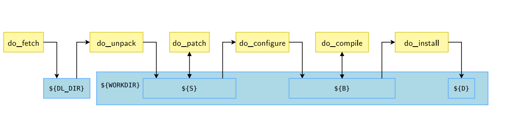

# Yocto Build Tasks 

Build tasks are the individual steps (e.g., fetching, configuring, compiling) that BitBake executes to transform source code into a deployable image or package. 

---



## Common Build Tasks

Here’s a list of the most common tasks in a Yocto build, their purposes, and examples of how they’re used.

### 1. `do_fetch`
- **Purpose**: Downloads source code specified in `SRC_URI` (e.g., from Git, tarballs, or local files).
- **Output**: Stores files in `${WORKDIR}` (e.g., `~/YOCTO/build_rpi/tmp/work/...`).
- **Example**:
  ```bitbake
  # Recipe: recipes-example/myapp/myapp_1.0.bb
  SUMMARY = "Simple App"
  SRC_URI = "git://github.com/example/myapp.git;protocol=https;branch=main"

  # Fetch the source
  bitbake -c fetch myapp
  ```

### 2. `do_unpack`
- **Purpose**: Extracts fetched files (e.g., tarballs, Git repos) into `${WORKDIR}`.
- **Output**: Populates `${S}` (source directory, e.g., `${WORKDIR}/git`).
- **Example**:
  ```bitbake
  # After fetching, unpack it
  bitbake -c unpack myapp
  ```

### 3. `do_patch`
- **Purpose**: Applies patches listed in `SRC_URI` to the source code.
- **Example**:
  ```bitbake
  SRC_URI += "file://fix-bug.patch"

  # Apply the patch
  bitbake -c patch myapp
  ```
- **Notes**: Patches must be in `${WORKDIR}` (e.g., alongside the recipe in a `files/` directory).

### 4. `do_configure`
- **Purpose**: Prepares the source for compilation (e.g., running `./configure` or custom setup).
- **Default**: Empty unless overridden or inherited.
- **Example**:
  ```bitbake
  # Recipe with a Makefile needing customization
  do_configure() {
      sed -i 's/-O2/-O3/' Makefile
  }

  bitbake -c configure myapp
  ```

### 5. `do_compile`
- **Purpose**: Builds the software (e.g., compiles source code into binaries).
- **Default**: Runs `oe_runmake` if a Makefile exists.
- **Example**:
  ```bitbake
  # Recipe for a Makefile-based app
  do_compile() {
      oe_runmake all
  }

  bitbake -c compile myapp
  ```
- **Notes**: Output goes to `${B}` (build directory, often same as `${S}`).

### 6. `do_install`
- **Purpose**: Installs built files into `${D}` (destination directory for the target filesystem).
- **Example**:
  ```bitbake
  do_install() {
      oe_runmake install DESTDIR=${D}
      # Or manually:
      install -d ${D}${bindir}
      install -m 0755 myapp ${D}${bindir}/myapp
  }

  bitbake -c install myapp
  ```
- **Notes**: `${D}${bindir}` is typically `/usr/bin` on the target.

### 7. `do_package`
- **Purpose**: Splits installed files into packages (e.g., `${PN}`, `${PN}-dev`).
- **Example**:
  ```bitbake
  FILES:${PN} = "${bindir}/*"
  FILES:${PN}-dev = "${includedir}/*"

  bitbake -c package myapp
  ```

---

## Practical Examples

### Example 1: Building a Simple C Program
```bitbake
# recipes-example/hello/hello_1.0.bb
SUMMARY = "Hello World"
LICENSE = "MIT"
LIC_FILES_CHKSUM = "file://LICENSE;md5=xxx"
SRC_URI = "file://hello.c"

S = "${WORKDIR}"

do_compile() {
    ${CC} ${CFLAGS} ${S}/hello.c -o ${B}/hello
}

do_install() {
    install -d ${D}${bindir}
    install -m 0755 ${B}/hello ${D}${bindir}/hello
}

FILES:${PN} = "${bindir}/hello"
```
- Build it:
  ```bash
  bitbake hello
  ```
---


## Task Execution and Debugging

### Running Specific Tasks
- Use `-c` to execute a single task:
  ```bash
  bitbake -c compile myapp
  ```


### Viewing Task Logs
- Check logs in `${WORKDIR}/temp/` (e.g., `log.do_compile`):
  ```bash
  cat ~/YOCTO/build_rpi/tmp/work/*/myapp/1.0/temp/log.do_compile
  ```
---

## Task Dependencies

Tasks depend on each other in a chain:
- `do_fetch` → `do_unpack` → `do_patch` → `do_configure` → `do_compile` → `do_install` → `do_package`
- BitBake automatically manages this.

---

## Applying to Your Build

For your `core-image-weston` Raspberry Pi build:
- Check tasks for a recipe (e.g., `weston`):
  ```bash
  bitbake -c listtasks weston
  ```

---

## Referances :

- [https://youtu.be/a6dB7Z2HlNM?si=Bq-gS_bnhQFdhxe5]
- [https://youtu.be/ZIJACtKHN84?si=FAa812XbYKEqtNmI]
- [https://youtu.be/1KpKzFY9rw0?si=gsZwkXiQxCBE9mGa]
- [https://youtu.be/H3LVO1zRpBA?si=uBgLBwk_IBs-Vw-1]
- [https://youtu.be/YuB_bxjFePs?si=NeSo_un6_bdrsBSc]
- [https://youtu.be/RtAAO6uZ59k?si=G-YhC6cQJRE-mNDm]
- [https://youtu.be/ZKIcylBUNw8?si=WcojBNcCR1hkurpd]
- [https://youtu.be/jeMzB8N-wR0?si=ybWRqpej6ObFmO5D]
- [https://bootlin.com/doc/training/yocto/yocto-slides.pdf]
- [https://docs.yoctoproject.org/ref-manual/tasks.html]

